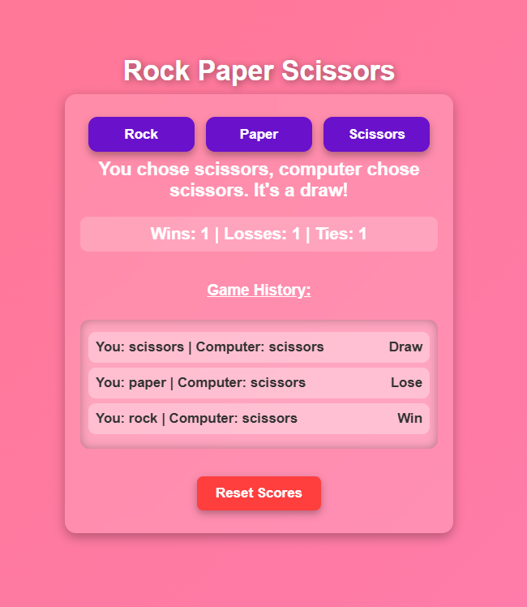

# 🎮 Rock Paper Scissors – Full Stack Prototype


A web-based interactive game designed to demonstrate **Client–Server Architecture**, **RESTful API Integration**, and **State Management** using a Spring Boot backend and a responsive frontend.



---

## 🎯 Project Goal

This project serves as a technical prototype to explore:

* **REST API Design** – Structuring endpoints for retrieving and updating game state
* **Asynchronous Communication** – Using the Fetch API to decouple UI from backend logic
* **UI/UX Design** – Implementing a modern Glassmorphism interface with responsive animations

---

## ✨ Key Features

* **Backend Logic** – Game state (Wins, Losses, Ties) is managed by the server with session-based persistence
* **Real-Time Feedback** – Frontend dynamically updates the DOM using JSON responses
* **History Log** – Displays last 10 moves with color‑coded badges
* **Health Check Endpoint** – Confirms backend availability

---

## 🛠️ Tech Stack

| Component    | Technology              | Description                              |
| ------------ | ----------------------- | ---------------------------------------- |
| Backend      | Java 17, Spring Boot    | Handles game logic and score persistence |
| Frontend     | HTML5, CSS3, JavaScript | Responsive UI with Fetch API             |
| Build Tool   | Maven                   | Dependency management                    |
| Architecture | MVC / REST              | Separation of concerns                   |

---

## 🔌 API Reference

| Method | Endpoint         | Description            | Payload / Response                     |
| ------ | ---------------- | ---------------------- | -------------------------------------- |
| GET    | `/health-check`  | Server status check    | Returns `"Ok"`                         |
| GET    | `/scores`        | Get current scoreboard | `{ "wins": 1, "loses": 0, "ties": 0 }` |
| POST   | `/scores/{type}` | Increment score        | Path Variable: `wins`, `loses`, `ties` |
| PUT    | `/scores`        | Reset game             | `{ "wins": 0, "loses": 0, "ties": 0 }` |
| PATCH  | `/scores/{type}` | Manual override        | Query Param: `?new-value=5`            |

---

## 🚀 How to Run Locally

### Prerequisites

* JDK 17+
* Maven

### Step 1: Start Backend

```bash
git clone https://github.com/rehann07/Rock-Paper-Scissors-Game.git

cd Rock-Paper-Scissors-Game

mvn spring-boot:run
```

### Step 2: Launch Frontend

1. Locate `index.html`
2. Open it in any modern browser
3. Start playing 🎮

---

## 💻 Code Structure

* `com.mncz.rps.setting_scores.controller` – REST controllers
* `com.mncz.rps.setting_scores.entity` – Scores POJO
* `index.html` – UI, embedded CSS & JavaScript logic

---

## 📝 Future Improvements

* Database integration (MySQL / MongoDB)
* Multiplayer support using WebSockets
* Docker containerization

---

*Created by [Rehan Naikwadi](https://github.com/rehann07)*
